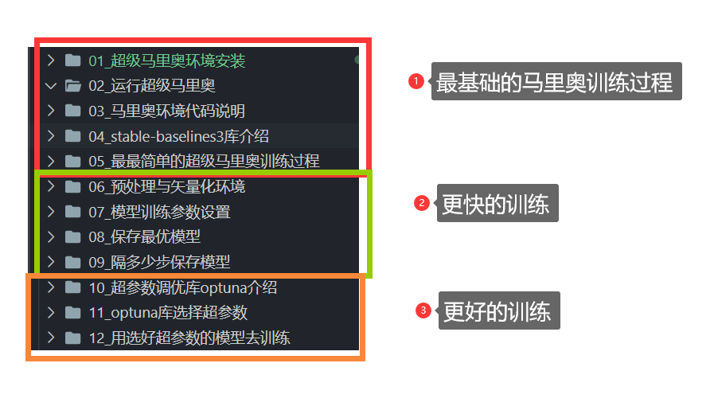

# 00\_强化学习玩马里奥课程介绍

日期: 周六- 2022-03-05 00:02:58

作者: 范仁义

---

🍓

TODO:

---

1😍4💜10😈 复习记忆 🚩 重点 ⭐

~

~

~

🍎

🍓

🍊

🍒

# 一、课程内容

🍌

🍑

🍍

# 二、课程特点

🍉

1、会告诉大家怎么查看资料（教大家自学的能力）

2、一句句的带着大家敲代码

🍇

尽我我能，让大家快速学会

🍋

🍅

🍐

📖

🍧

🍓

📒

🔧

🌱

🌺

🔥

✨

🍹

🧊

🍄

🌷

💮

🌸

🍁

🌳

🌲

🌴

🍎

🍓

🍊

🍒

🍌

🍑

🍍

🍉

🍇

🍋

🍅

🍐

📖

🍧

🍓

📒

🔧

🌱

🌺

🔥

✨

🍹

🧊

🍄

🌷

💮

🌸

🍁

🌳

🌲

🌴
