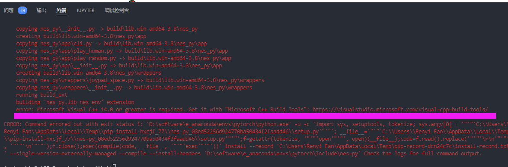
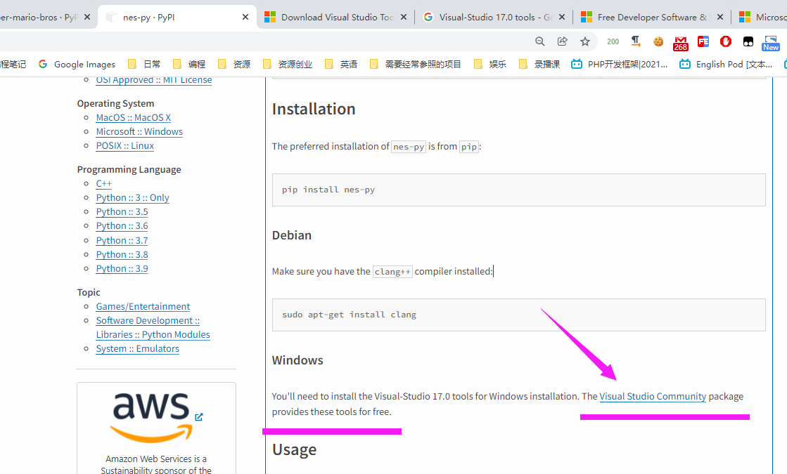
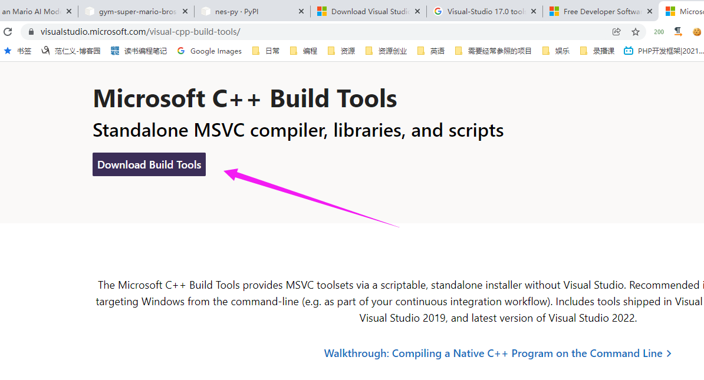
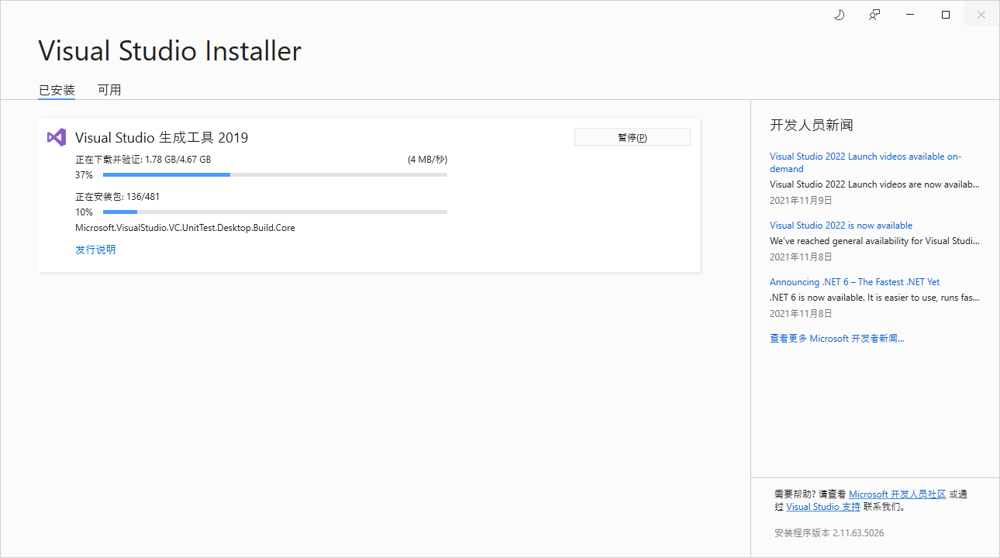
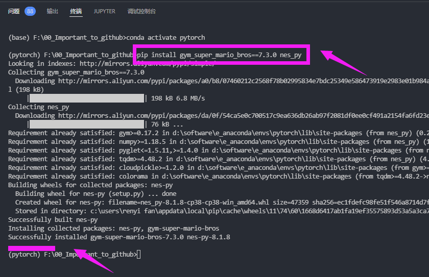

# nes-py 包安装实录

日期: 周三- 2022-02-16 18:14:27

作者: 范仁义

---

🍓

TODO:

---

1😍4💜10😈 复习记忆 🚩 重点 ⭐

<div style='color:#fe618e;font-weight:800;font-size:23px;'>~</div>

<div style='color:#6f67e0;font-weight:800;font-size:23px;'>~</div>

<div style='color:#19ce8b;font-weight:800;font-size:23px;'>~</div>

🍎

🍓

🍊

🍒

# 一、要先安装 visual studio

🍌

error: Microsoft Visual C++ 14.0 or greater is required. Get it with "Microsoft C++ Build Tools": https://visualstudio.microsoft.com/visual-cpp-build-tools/



🍑

不然安装不了 nes_py 环境

```
pip install nes_py
```

🍍



🍉

🍇

# 二、安装 visual studio

🍋

网址：

https://visualstudio.microsoft.com/visual-cpp-build-tools/

🍅



🍐

📖

安装中



🍧

🍓

📒

# 三、安装成功

```
pip install gym_super_mario_bros==7.3.0 nes_py
```



🔧

🌱

🌺

🔥

✨

🍹

🧊

🍄

🌷

💮

🌸

🍁

🌳

🌲

🌴

🍎

🍓

🍊

🍒

🍌

🍑

🍍

🍉

🍇

🍋

🍅

🍐

📖

🍧

🍓

📒

🔧

🌱

🌺

🔥

✨

🍹

🧊

🍄

🌷

💮

🌸

🍁

🌳

🌲

🌴
