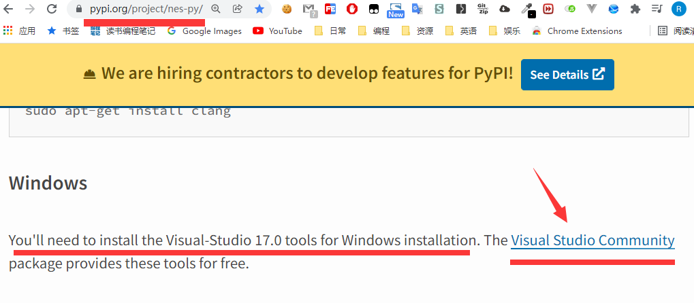
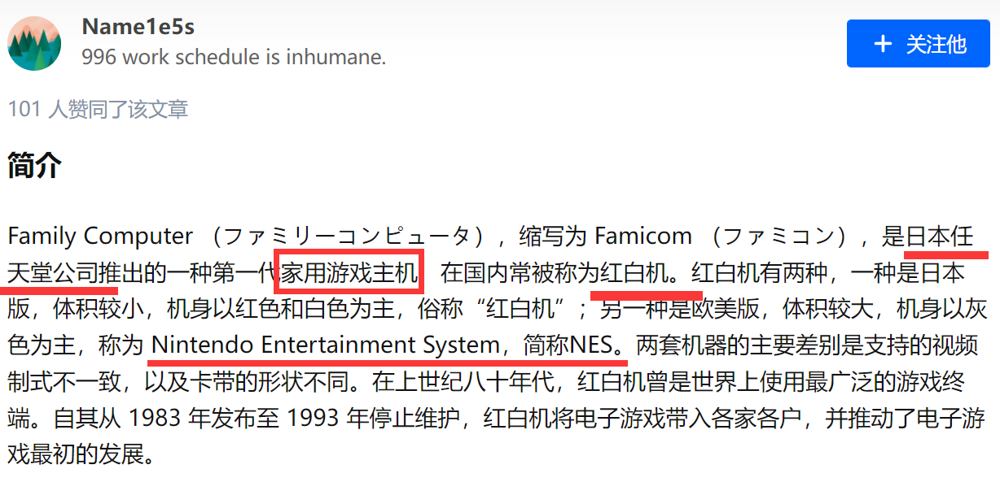

# 超级马里奥环境安装

日期: 周四- 2022-02-24 17:20:51

作者: 范仁义

---

🍓

TODO:

---

1😍4💜10😈 复习记忆 🚩 重点 ⭐

<div style='color:#fe618e;font-weight:800;font-size:23px;'>~</div>

<div style='color:#6f67e0;font-weight:800;font-size:23px;'>~</div>

<div style='color:#19ce8b;font-weight:800;font-size:23px;'>~</div>

🍎

🍓

🍊


🍒

# 一、环境安装

🍌

## 1、安装超级马里奥环境

```
https://pypi.org/project/gym-super-mario-bros/
```

🍑

```
pip install gym-super-mario-bros
```

🍑

## 2、安装 python 版本的 nes 模拟器

```
https://pypi.org/project/nes-py/

https://github.com/Kautenja/nes-py
```

🍍

```
pip install nes-py
```

🍍

##### 💜、nes-py 安装注意

> <div style='color:#ff0000;font-weight:800;font-size:23px;'>nes-py安装的时候需要依赖 Microsoft C++ Build Tools</div>
>
> ```
> https://pypi.org/project/nes-py/
> ```
>
> ~



🍉

### a、nes 模拟器是什么

```
https://zhuanlan.zhihu.com/p/34636695
```

🍇



🍇

### b、nes-py 是什么

🍋

nes_py 是 python 用来模拟 nes 的包，也就是 python 版本的 nes 模拟器

🍅

🍐

📖

🍧

🍓

📒

🔧

🌱

🌺

🔥

✨

🍹

🧊

🍄

🌷

💮

🌸

🍁

🌳

🌲

🌴

🍎

🍓

🍊

🍒

🍌

🍑

🍍

🍉

🍇

🍋

🍅

🍐

📖

🍧

🍓

📒

🔧

🌱

🌺

🔥

✨

🍹

🧊

🍄

🌷

💮

🌸

🍁

🌳

🌲

🌴
