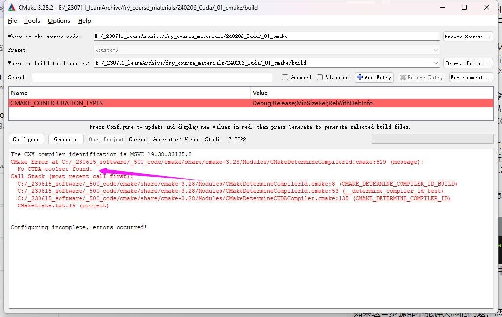
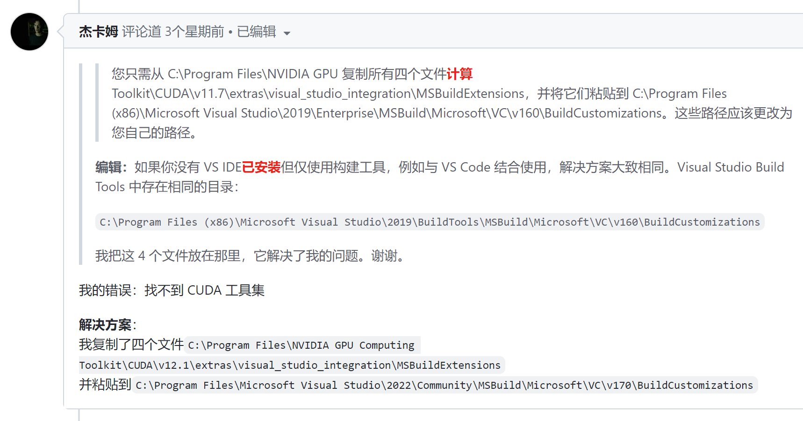
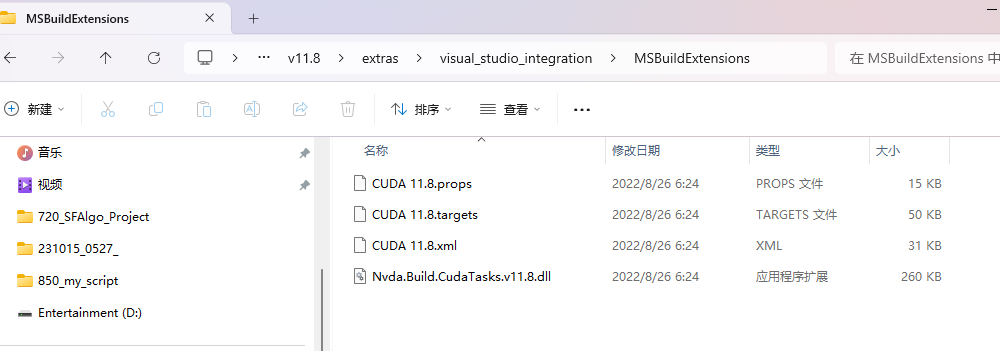
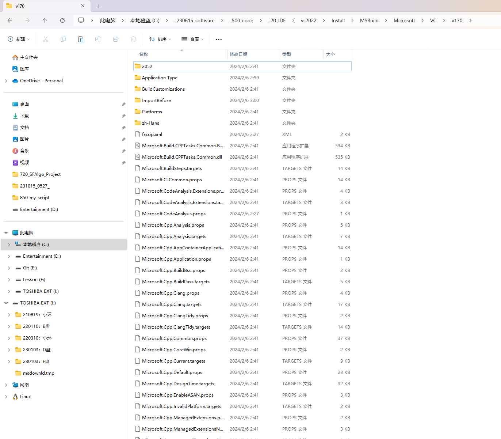
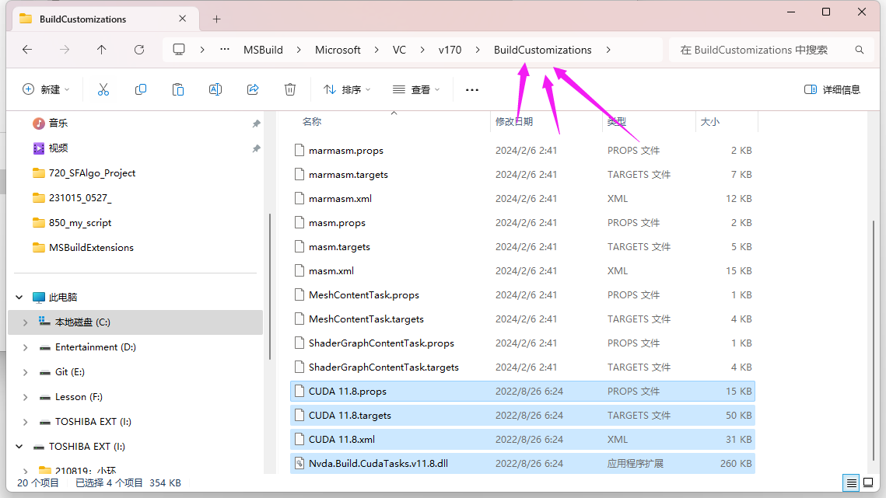
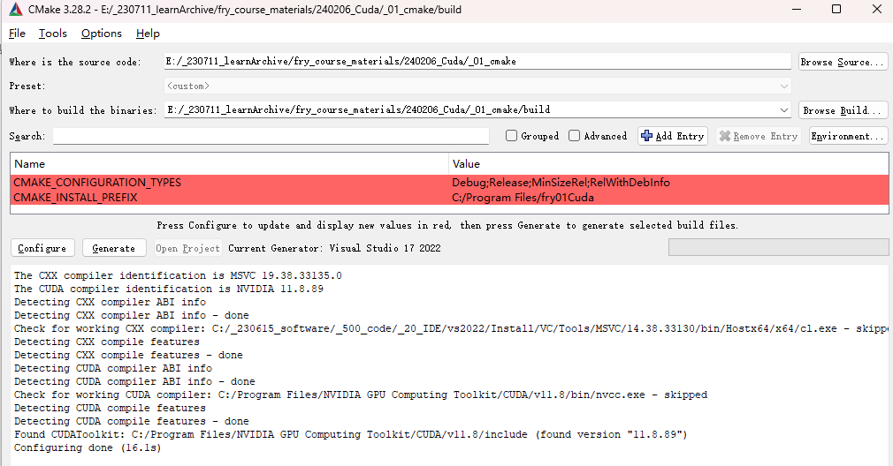
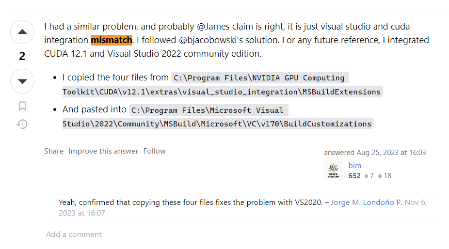

# 亲测

日期: 周二- 2024-02-06 03:34:14

作者: 范仁义

---

🍎

🍓

🍊

# 一、问题

🍒



🍌

🍑

# 二、参照解决

🍍

🍋



🍅

🍐

# 三、亲测

📖

🍉



🍇

🍧

🍓



📒

🔧

<div style=color:#0099ff;font-weight:800;font-size:23px;>粘贴到这里</div>

🌱



🌺

🔥

##### 【⭐、注意：不要粘贴到 v170 下】

> <div style='color:#ff6600;font-weight:800;font-size:23px;'>是粘贴到 v170\BuildCustomizations 下</div>

✨

🍹

🧊

🍄

# 四、成功

🌷

💮

🌸



🍁

🌳

🌲

# 五、问题原因

🌴

```
c++ - CUDA compile problems on Windows, Cmake error: No CUDA toolset found - Stack Overflow
https://stackoverflow.com/questions/56636714/cuda-compile-problems-on-windows-cmake-error-no-cuda-toolset-found

```

🍎



🍓

🍊

🍒

🍌

🍑

🍍

🍉

🍇

🍋

🍅

🍐

📖

🍧

🍓

📒

🔧

🌱

🌺

🔥

✨

🍹

🧊

🍄

🌷

💮

🌸

🍁

🌳

🌲

🌴
