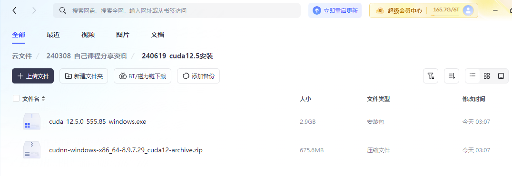
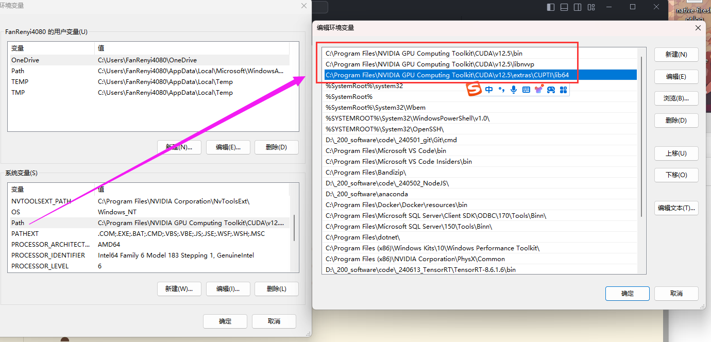

# cuda12.5 安装详情

日期: 周三- 2024-06-19 03:08:29

作者: 范仁义

---

🍎

🍓

🍊

🍒

🍌

# 一、文件下载地址

🍑

🍍

🍉

```
我用夸克网盘分享了「_240619_cuda12.5安装」，点击链接即可保存。
链接：https://pan.quark.cn/s/e43e28462209
```

🍇

🍋



🍅

🍐

🌷

💮

# 二、具体安装步骤

🌸

🍁

详见 pdf

🌳

🌲

📖

🍧

# 三、添加环境变量

🍓

📒

🔧

```

C:\Program Files\NVIDIA GPU Computing Toolkit\CUDA\v12.5\bin
C:\Program Files\NVIDIA GPU Computing Toolkit\CUDA\v12.5\libnvvp
C:\Program Files\NVIDIA GPU Computing Toolkit\CUDA\v12.5\extras\CUPTI\lib64

```

🌱

🌺



🔥

✨

🍹

🧊

🍄

🌷

💮

🌸

🍁

🌳

🌲

🌴

🍎

🍓

🍊

🍒

🍌

🍑

🍍

🍉

🍇

🍋

🍅

🍐

📖

🍧

🍓

📒

🔧

🌱

🌺

🔥

✨

🍹

🧊

🍄

🌷

💮

🌸

🍁

🌳

🌲

🌴
