# 添加注意力机制步骤

日期: Thu- 2024-03-14 07:37:50

作者: 范仁义

---

🍎

🍓

🍊

🍒

🍌

🍑

🍍

🍉

# 一、找好你要添加的注意力机制代码

以 CBAM 注意力机制为例，默认 yolov8 就包含了 CBAM 的注意力机制的代码

🍇

🍋

🍅

🍐

📖

# 二、放入注意力机制代码

在 `conv.py` 文件下 路径：`ultralytics/nn/modules/conv.py` 放入注意力机制代码

🍧

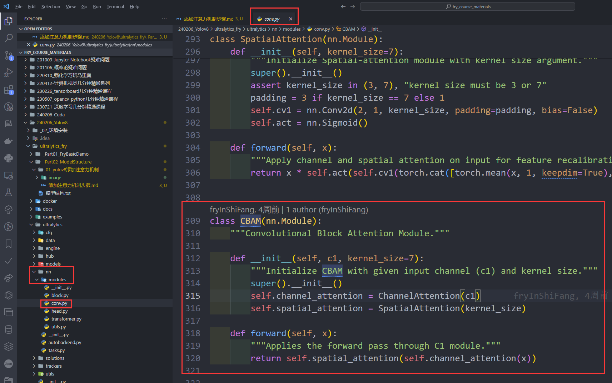

🍓

📒

🔧

# 三、添加这个注意力机制模块

添加这个注意力机制模块，让 yolov8 可以找到它

## 1、在 `conv.py` 的 `__all__`里添加模块名字

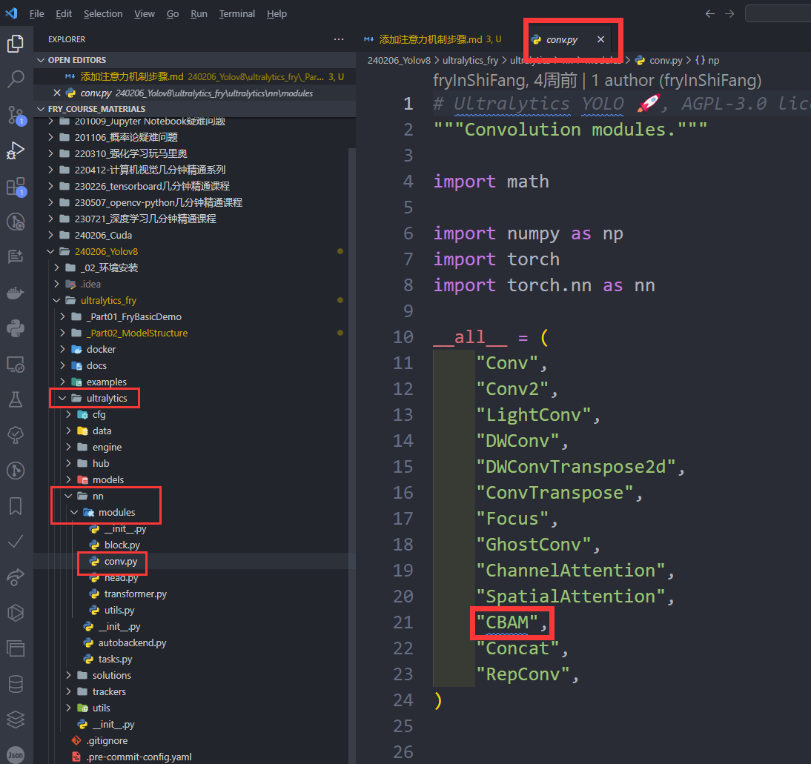

🌱

🌺

## 2、在 `ultralytics/nn/modules/__init__.py` 添加模块名字

🔥

✨

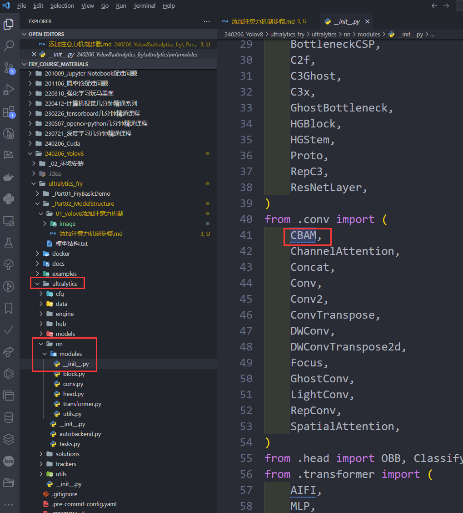

🍹

🧊

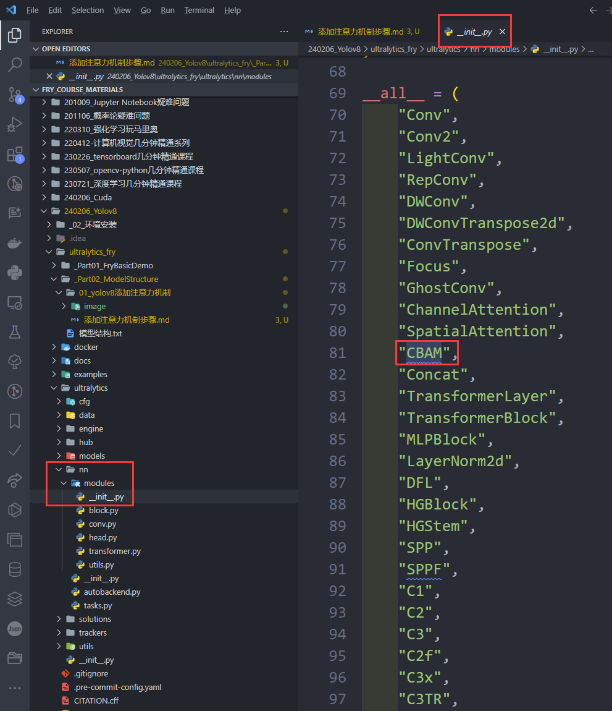

🍄

🌷

💮

## 3、在 `ultralytics/nn/tasks.py` 添加模块名字

🌸

🍁

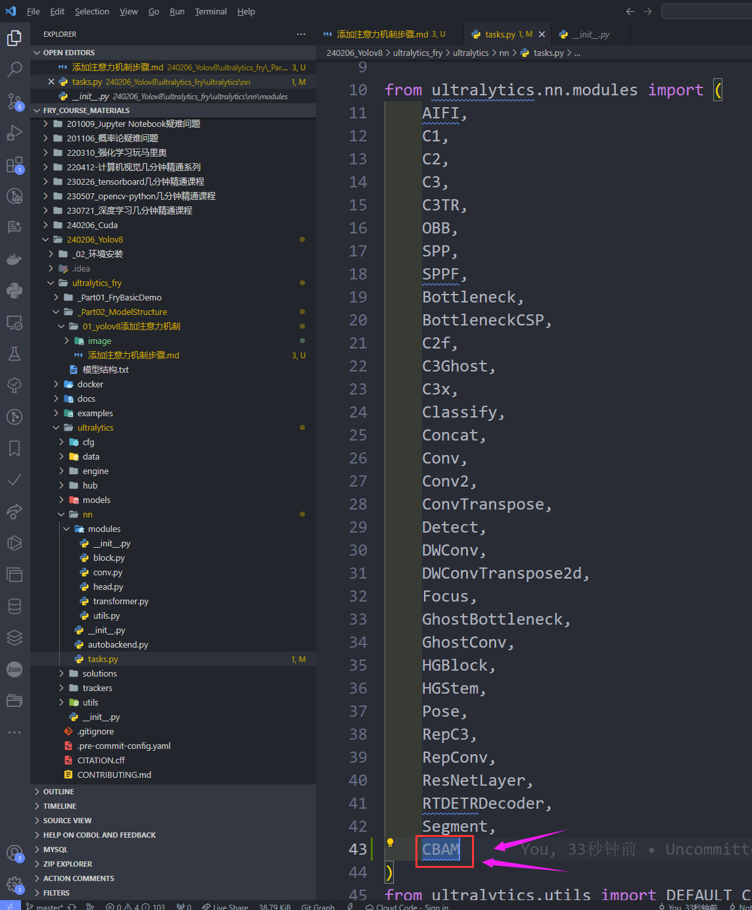

🌳

🌲

🌴

# 四、添加 yolov8 处理对应模块的代码

🍎

在 `ultralytics/nn/tasks.py` 的 `parse_model` 函数下添加如下解析我们加的注意力机制的模块的代码

🍓

```python
elif m in {CBAM}:
    c1, c2 = ch[f], args[0]
    if c2 != nc:
        c2 = make_divisible(min(c2, max_channels) * width, 8)
    args = [c1, *args[1:]]
```

🍊

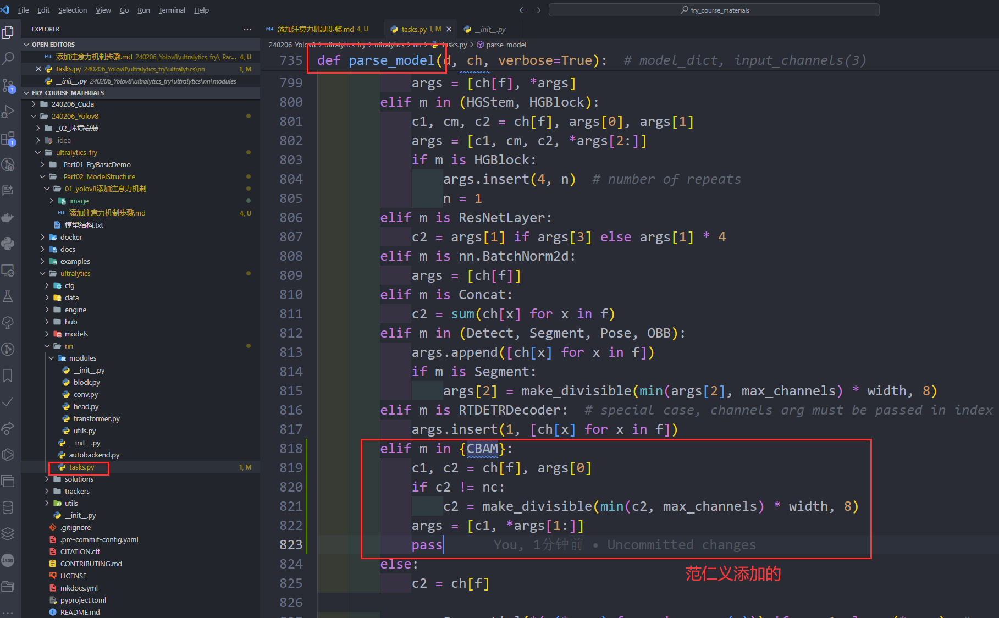

🍒

🍌

🍑

🍍

🍉

# 五、修改配置文件

🍇

🍋

添加 CBAM 层

🍅

🍐

并且修改如下这些层

📖

🍧

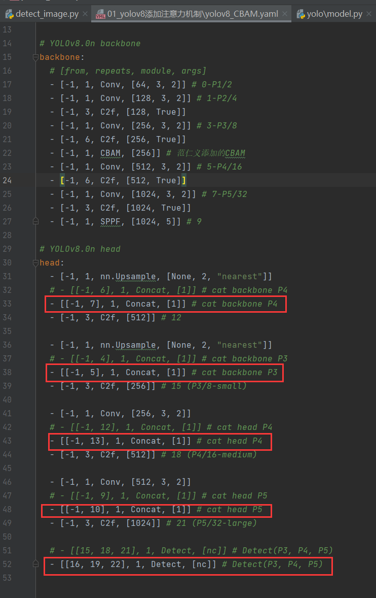

🍓

📒

🔧

# 六、出现如下错误

🌱

🌺

原因是模块的变化，导致 yolo 读取的代码是我们 pip install ultralytics 中的代码

而非我们修改注意力机制的代码

🔥

✨

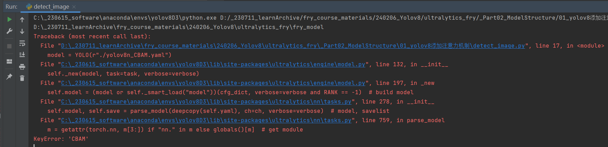

🍹

🧊

🍄

# 七、修改模块名，便于区分

🌷

💮

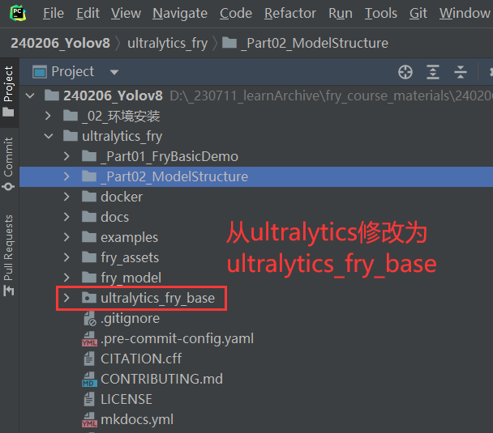

🌸

🍁

🌳

# 八、修改库引入

🌲

🌴

## 1、

修改如下文件中的文件引入部分

`240206_Yolov8/ultralytics_fry/ultralytics_fry_base/__init__.py`

🌱

🌺

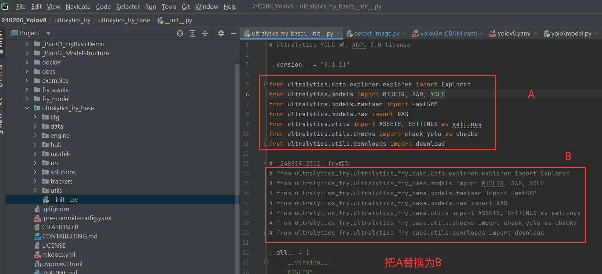

🔥

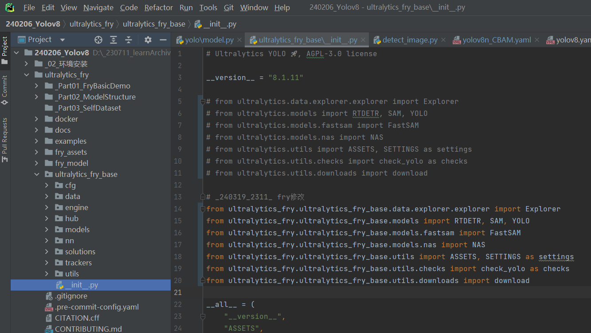

✨

🍹

## 2、

🧊

🍄

修改如下文件中的文件引入部分

`240206_Yolov8/ultralytics_fry/ultralytics_fry_base/models/yolo/model.py`

🌷

💮

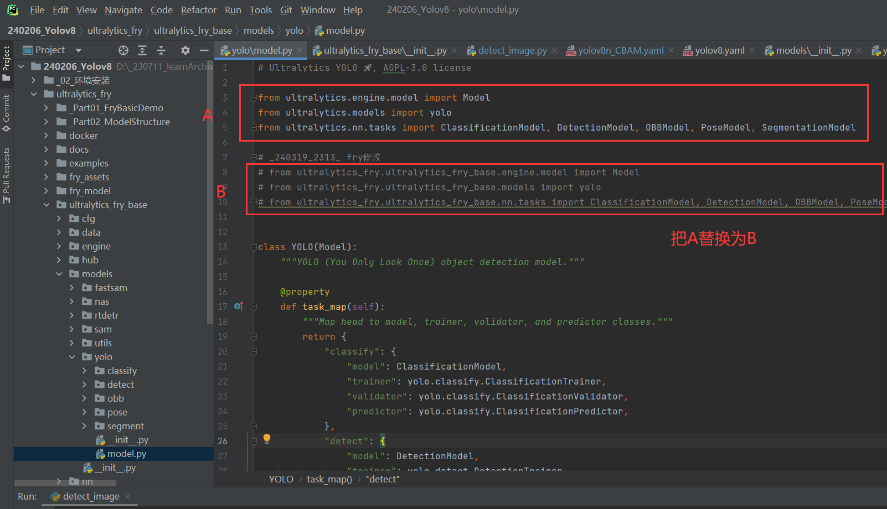

🌸

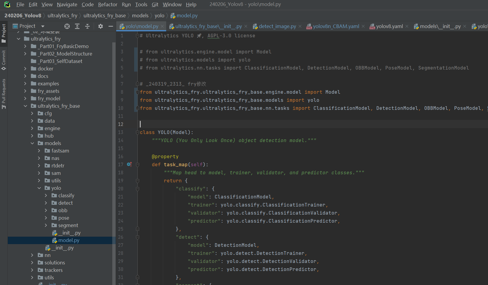

🍁

🌳

# 九、成功运行

🌲

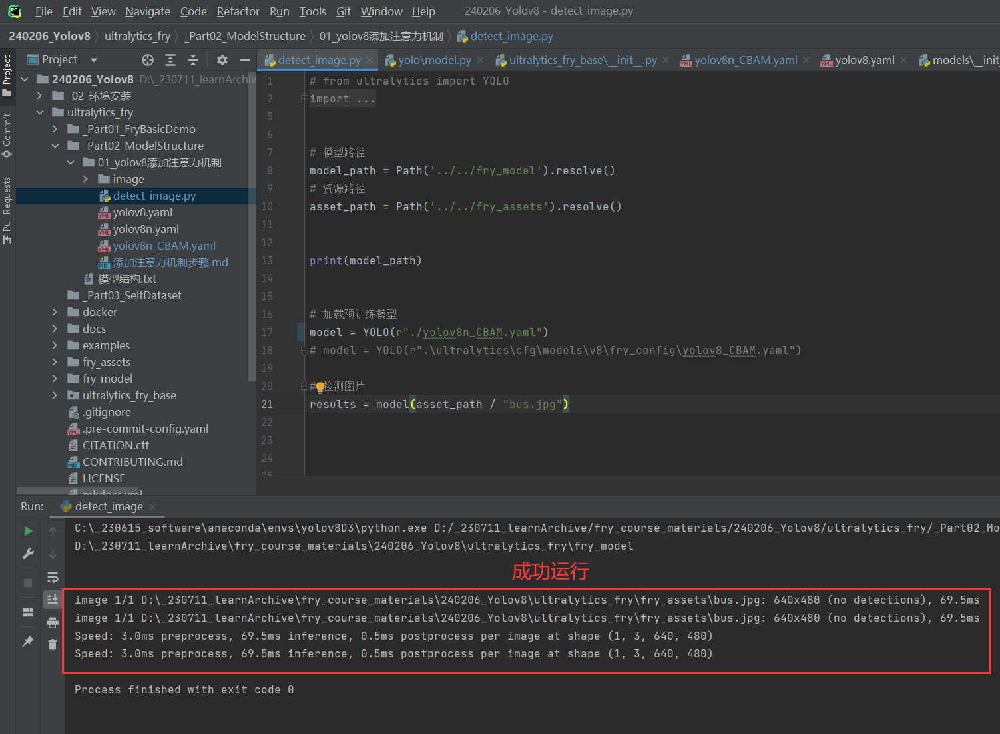

🌴

🌱

🌺

🔥

✨

🍹

🧊

🍄

🌷

💮

🌸

🍁

🌳

🌲

🌴
